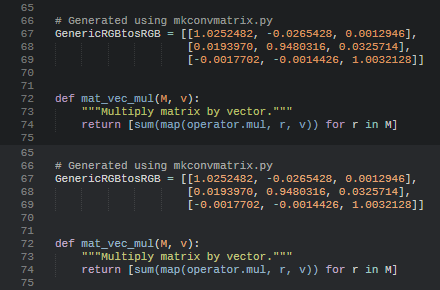

tmTheme Color Convert
=====================

These are Python scripts I wrote while working on a blog post about the
effects of color management on themes in text editors.

Many [TextMate](http://macromates.com/) color themes were designed on Mac
OS X, which used the Generic RGB color profile and a gamma of 1.8 by default.
This results in the colors being darker if used directly on Windows.

For portability and compatibility with other editors and operating systems,
it is better to use sRGB.

This script will convert the color values in a tmTheme file from Generic RGB
to sRGB, optionally applying simple alpha blending with the foreground and
background colors.

Usage
-----

The scripts are written for Python 3.

`tmcolorconv.py` takes a tmTheme file and changes the color values from
Generic RGB to sRGB. A gamma value to be used for the original file can be
supplied, and optionally colors with alpha values can be blended with
foreground/background color instead of copied.

    usage: tmcolorconv.py [-h] [-g GAMMA] [-b] infile outfile

    Convert Generic RGB to sRGB.

    positional arguments:
      infile                input tmTheme file
      outfile               output tmTheme file

    optional arguments:
      -h, --help            show this help message and exit
      -g GAMMA, --gamma GAMMA
                            input gamma (default 1.8)
      -b                    blend alpha

`mkconvmatrix.py` is a playground for working with color space conversions. It
was used to compute the `GenericRGBtosRGB` matrix used in `tmcolorconv.py`.

Examples
--------

These screenshots show the themes from the examples folder in
[Sublime Text 3][Sublime] on Windows.

Original and sRGB version of [Monokai][]:

Original and sRGB version of [Tomorrow Night][Tomorrow]:

Original and sRGB version of [Twilight][]:

[Sublime]: http://www.sublimetext.com/
[Monokai]: http://www.monokai.nl/blog/2006/07/15/textmate-color-theme/
[Tomorrow]: https://github.com/chriskempson/tomorrow-theme
[Twilight]: https://github.com/textmate/themes.tmbundle

License
-------

This projected is licensed under the terms of the [MIT license](LICENSE).
